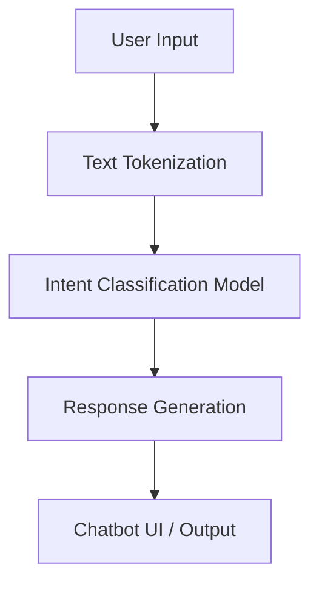

# Health Chatbot

## Overview
An interactive Deep Learning application designed to act as a health chatbot. It processes user text input, analyzes intents, and provides relevant health-related suggestions using neural networks.

## Architecture / Tech Stack
- **Language**: Python
- **Deep Learning**: TensorFlow/Keras, PyTorch
- **NLP Processing**: NLTK / SpaCy
- **Environment**: Jupyter Notebooks



## Local Setup Instructions
```bash
git clone https://github.com/PatVraj/Health-Chatbot.git
cd Health-Chatbot
python -m venv .venv
source .venv/bin/activate
pip install -r requirements.txt
# Run the core model
jupyter notebook
```

## Key Results / Metrics
- Achieved high intent-recognition accuracy to map user queries to the correct health domains.
- Structured code for future scalability into a full web-based conversational agent.

## Data Provenance & Licensing
- Relies on an aggregated dataset (`data/Combined Data.csv`). Use dataset only as permitted by its source.

## Collaborators
- Vraj Patel
