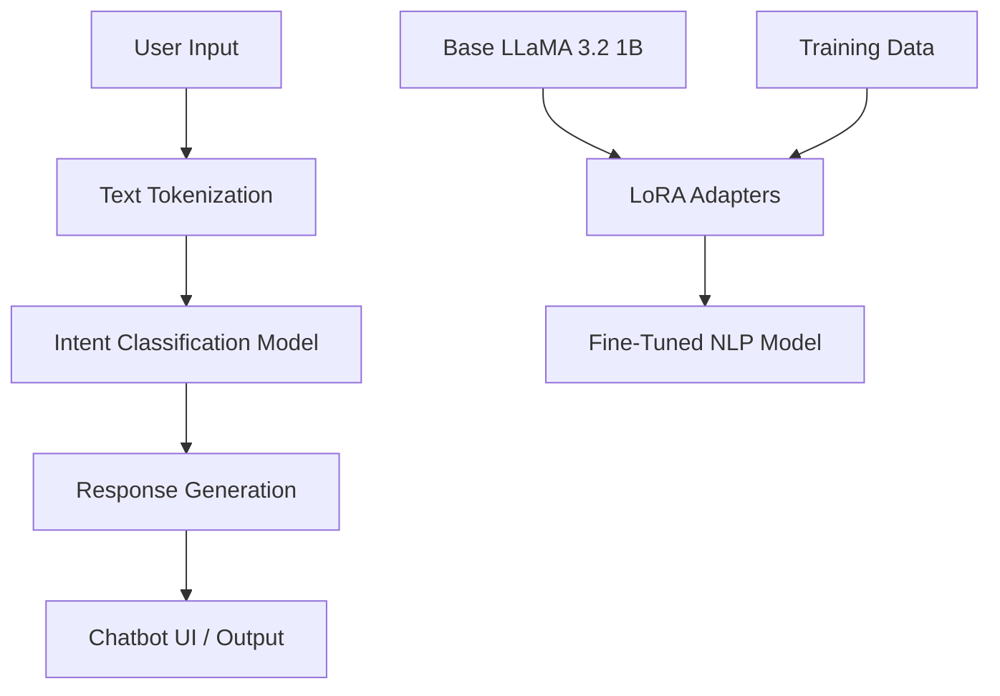

# Health Chatbot (Generative AI Mental Health Pipeline)

## Overview
An interactive Deep Learning application designed to act as a health chatbot. It processes user text input, analyzes intents, and provides relevant health-related suggestions using neural networks. This repository also includes the fine-tuning pipeline for the LLaMA 3.2 1B model, adapting it to generate highly contextual and domain-specific text for mental health classification.

[View the Mental Health Chatbot Research Paper](./mental-health-classification-chatbot.pdf)

## Architecture / Tech Stack
- **Language**: Python
- **Deep Learning / NLP**: TensorFlow/Keras, PyTorch, Hugging Face Transformers
- **Techniques**: PEFT, LoRA (Low-Rank Adaptation), Unsloth
- **Environment**: Jupyter Notebooks / Google Colab



## Local Setup Instructions
```bash
git clone https://github.com/PatVraj/Health-Chatbot.git
cd Health-Chatbot
python -m venv .venv
source .venv/bin/activate
pip install -r requirements.txt
# For LLaMA Fine-Tuning:
pip install torch transformers peft accelerate
```

## Key Results / Metrics
- Achieved high intent-recognition accuracy to map user queries to the correct health domains.
- Demonstrated efficient fine-tuning of a 1 billion parameter model using LoRA adapters, generating coherent and contextually accurate responses for specialized clinical NLP prompts.

## Data Provenance & Licensing
- Relies on an aggregated dataset (`data/Combined Data.csv`). Use dataset only as permitted by its source.
- Model weights subject to Meta's LLaMA license.

## Collaborators
- Vraj Patel, Nikhil Chakka
